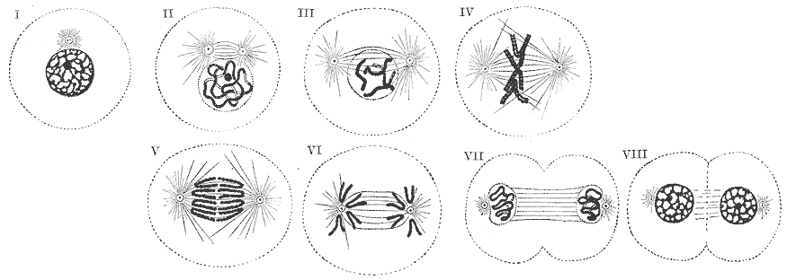
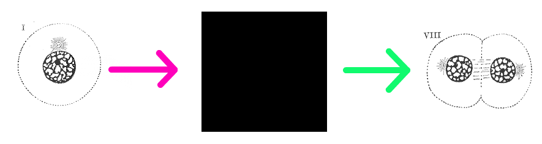

# Functions

## Intro
### Why Functions?

Take a look at this program that asks for two numbers and adjusts them to always fit between 0–10

```python
left_vol = input('Left volume:')
left_vol = int(left_vol)

if left_vol < 0:
    left_vol = 0

if left_vol > 10:
    left_vol = 10

right_vol = input('Right volume:')
right_vol = int(right_vol)

if right_vol < 0:
    right_vol = 0

if right_vol > 10:
    right_vol = 10
```

What are some problems with this code?

Here’s another version of the same program

```python
def fix_vol(volume):
    """Set volume within 0-10."""

    volume = int(volume)

    if volume < 0:
        volume = 0

    if volume > 10:
        volume = 10

    return volume

left_vol = fix_vol(input('Left volume:'))
right_vol = fix_vol(input('Right volume:'))
```

Why is this better?

>### Note: *The problem with duplicated code*
>---
>Duplicate code performs just as well as code contained in a function, so computers don’t have a problem with duplicated code — humans do.
>
>When developers sit down to read code, they bring expectations of what code should look like with them. Most developers won’t expect to see repeated blocks of code, which means it’d probably take them a little longer to recognize that the blocks of code are doing the same thing.
>
>Code would also be harder to maintain if no one used functions. Instead of updating your code in one place, you’d have to hunt down all the relevant blocks of code and update each of them, one at a time.

### Goals
Understand why and when developers use functions

Be able to identify the parts of a function and write one in Python

Learn about the rules that govern function behavior like scope and what happens when functions return values

## Functions
### What are Functions?
Functions are

- A way to label and organize **reusable** blocks of code

- Boxes that take inputs and perform computations using those inputs before outputting something

### Functions Help Organize Code
We organize books into chapters, essays into paragraphs, instructions into steps, and the color spectrum into colors.

Functions allow us to break up our code into chunks that perform a single operation and name them.

Functions help us turn this…

```python
nums = [1, 3]

# Sum up all numbers in list
total = 0
for num in nums:
    total += num

print(total)
…into this!

def sum_nums(nums):
    total = 0
    for num in nums:
        total += num

    return total

nums = [1, 3]
print(sum_nums(nums))
```

### Functions for Simplicity
This is a diagram of steps in cellular division


Here’s a simpler diagram:


Functions are like the black box!

- You can use a function even if you don’t understand what’s happening inside

- You only need to know the function’s inputs (if any) and its output

## Anatomy of a Function
### Structure

```python
def function_name(parameters):
    """Docstring"""

    function body

    → return value
```
### parameters
The function’s input(s)

### return value
The function’s output

### Function Signatures
Together, a function’s parameter(s) and return values are the function’s ***signature***

Ex.: ***sum_nums*** takes in a list of numbers and returns a number

### Function Name
- Legal identifier characters: `a-z A-Z 0-9 _`

    - But cannot start with a number

    - Good Python style uses snake_case

## Return Values
In Python, functions always return a value

- By default, functions implicitly return None

- To override the default, you can explicitly return a value with return <expression>

Here’s a function with an explicit return statement:

```python
def add_nums(x, y):
    """Return sum of x and y."""

    return x + y
```

You can capture a function’s return value in a variable to use it later

```python
total = add_nums(2, 3)

# (...snippet)

print(f'Your total is {total}')
```

What’s the return value of this function?

```python
def add_words(word1, word2):
    """Squish two words together."""

    print(word1 + word2)
```
```python
>>> result = add_words('hack', 'bright')
hackbright

>>> print(result)
None
```

Functions will **always** return *something* — by default that’s ***None***

A ***return*** without a value will return ***None*** as well:

```python
def process_file(path):
    """Print file until line starting with STOP HERE."""

    for line in open(path):
        line = line.rstrip()
        if line.startswith('STOP HERE'):
            return
        print(line)

    print('Entire file was printed')
```

What will the function return if we replace `return` with `break`?

Trick question! It’ll still return ***None***!

## Return vs. Print
A common error is printing when you actually meant to return

```python
def add_nums(x, y):
    """Sum of x and y."""

    print(x + y)
```

What happens when you run this?

```python
>>> total = add_nums(2, 3)
```

It’s important to know the effects of print vs. return so you can debug!

### print('hello')
Prints on screen but doesn’t exit function

### return 'hello'
Exits function and hands value back to call (but doesn’t print)

### You Can Only Return One Thing
This won’t work:

```python
def melons_in_season(season):
    """Return melons in season."""

    if season == "winter":
        return "Christmas Melon"

    else:
        return "Cantaloupe"
        return "Watermelon"   # Never runs :(
```

That thing can be a list:

```python
def melons_in_season(season):
    """Return melons in season."""

    if season == "winter":
        return ["Christmas Melon"]

    else:
        return ["Cantaloupe", "Watermelon"]
```

Not just lists — tuples, sets, dictionaries, & more!

## Parameters
A function can define *parameters*:

```python
def my_function(a, b, c):
      print(a, b, c)
      return "Success"
```

When the function is called, *arguments* are passed — these “fill in” those parameters:

```python
>>> my_function('apple', 'berry', 'cherry')
apple berry cherry
'Success'
```

> ### Parameters vs. Arguments
> ---
> Python (and most other languages) use the terms “parameters” and “arguments” as similar but with a small difference:
>
> ### parameters
>The list of things defined for a function to receive. When you create a function with `def calculate_order_total(price, qty)`, we’d say that this has two parameters, ***price*** and ***qty***
>
> ### arguments
>When you *call* a function, you provide arguments to it—so calling that function, like `calculate_order_total(9.99, 10)` has two arguments, ***9.99*** and ***10***.
>
>You can think about this as “the parameters are what function expects; the arguments are what it receives.”

If you define three parameters, you need to call the function with exactly three arguments:

```python
>>> my_function('apple', 'berry')
Traceback (most recent call last):
    ...
TypeError: my_function() takes exactly 3 arguments (2 given)
```

## Default Parameters
Can take optional parameters by giving a default:

```python
def my_function(a, b, c='cherry'):
    print(a, b, c)
    return "Success"
```
```python
>>> my_function('apple', 'berry')   # *Yay! This works*
apple berry cherry
'Success'

>>> my_function('apple', 'berry', 'cardamom')
apple berry cardamom
'Success'
```

You still need either two or three arguments to call it, though:

```python
>>> my_function('apple')
Traceback (most recent call last):
    ...
TypeError: my_function() takes at least 2 arguments (1 given)
```

Optional parameters must be defined last:

```python
>>> def my_bad_function(a, b='blackberry', c):
...    print(a, b, c)

File "<stdin>", line 1
SyntaxError: non-default argument follows default argument
```

In this case, Python wouldn’t know how to interpret a call like `my_bad_function(1, 2)` — is the 2 the value for ***b*** or ***c***?

## Docstrings
A Python convention for documenting functions.

```python
def add_two(x, y):
    """Add two numbers together.

    Add together x and y, returning results.
    """

    return x + y
```

- Must come right after function declaration

- Use triple-quotes

    - Multi-line string must use triple quotes

- **First line**: single-line overview

- **Rest of docstring** *(after blank line)*: more detail

## Calling Functions
### Calling
Unnamed arguments are used in order:

```python
def my_function(a, b, c):
    """Print a, b, and c."""

    print(a, b, c)
```
```python
>>> my_function('apple', 'berry', 'cherry')
apple berry cherry
```
```python
get_melon_order_price(5, 20)
```

Which is the cost and which is the quantity?

You have to look at the function declaration to tell:

```python
def get_melon_order_price(price, quantity):
    """Calculate the cost for an order of melons."""
```

You can also call with names:

```python
get_melon_order_price(price=5, quantity=20)
```

Now it’s very obvious which is which.

If you call with argument names, you can specify order:

```python
def print_items(a, b, c):
    """Print a, b, and c."""

    print(a, b, c)
```
```python
>>> print_items(c='cherry', a='apple', b='berry')
apple berry cherry
```

This also lets you skip some optional ones:

```python
def print_items(a, b='berry', c='cherry'):
    """Print a, b, and c."""

    print(a, b, c)
```
```python
>>> print_items('apple', c='cardamom')
apple berry cardamom
```

## Scope
### Arguments Become Variables
Passing in arguments

```python
def get_melon_order_price(price, quantity):
    """Cost for an order of melons."""

    # Passed in variables (price, quantity)
    # are available inside the function.

    return price * quantity
```
```python
>>> get_melon_order_price(5, 10)
50
```
has the same effect as

```python
def get_melon_order_price():
    """Cost for an order of melons."""

    price = 5
    quantity = 10

    return price * quantity
```
```python
>>> get_melon_order_price()
50
```
- ***price*** and ***quantity*** come from the arguments!

### Scope
“Where is a variable name meaningful?”

```python
def get_melon_order_price(price, quantity):
    """Calculate the cost for an order of melons."""

    tax = 0.075

    return price * quantity + (tax * price * quantity)
```

What will happen?

```python
print(price, quantity, tax)   # before function is called

get_melon_order_price(5, 10)

print(price, quantity, tax)   # after function is called
```
***price***, ***quantity***, and ***tax*** only are “in scope” inside function!

## Outer Scope
Functions can access variables defined outside — in the outer scope

…but anything outside can’t access values contained within functions

Here, ***tax*** is meaningful inside of the function

```python
tax = 0.075

def get_melon_order_price(price, quantity):
    """Calculate the cost for an order of melons."""

    return price * quantity + (tax * price * quantity)

get_melon_order_price(price=5, quantity=10)
```

This is a bad practice though!

This is much better:

```python
standard_tax = 0.075

def get_melon_order_price(price, quantity, tax):
    """Calculate the cost for an order of melons."""

    return price * quantity + (tax * price * quantity)

get_melon_order_price(price=5, quantity=10, tax=standard_tax)
```

That is, you only have to define it once if it’s globally-available, but it’s best to explicitly pass it in

> ### Global Variables and Constants
> ---
> In general, it’s best to avoid using global variables — keeping track of who changes them and where they’re changed is a pain.
>
> There are cases, though, where you’ll have something that would be useful many places in a program and shouldn’t be changed. This kind of variable, typically called a constant (because it’s constant and unchanging), is one case where it might be ok to refer to an outer scope variable in a function: since the constant variable shouldn’t ever change, you shouldn’t need to keep track of where it might get changed.
>
> Python programmers often give constant variables names that are in UPPER_CASE, like so. This signals to other people reading their code that the variable in question is a constant, and shouldn’t ever be changed.
>
> We might write our code above like so:
>
>```python
> CALIFORNIA_TAX_RATE = 0.075
>
> def get_melon_order_price(price, quantity, tax):
>    """Calculate the cost for an order of melons."""
>
>    return price * quantity + (tax * price * quantity)
>
># place an order in California
>
>get_melon_order_price(price=5, quantity=10, tax=CALIFORNIA_TAX_RATE)
>
> # place an international order with a special tax rate:
>
> get_melon_order_price(price=5, quantity=10, tax=0.125)
> ```

## Wrap-Up
### Yay Functions!
Functions make your code easier to read (and thus easier to maintain)

- They help organize code into reusable, named containers

    - Now you don’t have to duplicate your code

- They also simplify code — you don’t have to know how a function works to use it

### Style and Advice
- 1 function = 1 unit of thought

- Choose good names

    - `python_function_names_are_like_this`

    - Python function names are “verby”

        - Instead of `valid()`, choose `is_valid()` or `validate()`

- Use docstrings

- Pass values in explicitly

    - Generally, don’t depend on globally-defined variables

- Write more functions than you think!

    - If it’s over ~20 lines, can you break it into two?

## Looking Ahead
### Coming Up
- **Lots** of chances to use functions

- Functions vs. methods

### Advanced Ideas
- [Inner Functions](https://realpython.com/blog/python/inner-functions-what-are-they-good-for/)

- [Lambda Expressions](https://pythonconquerstheuniverse.wordpress.com/2011/08/29/lambda_tutorial/)

© 2022 Hackbright Academy